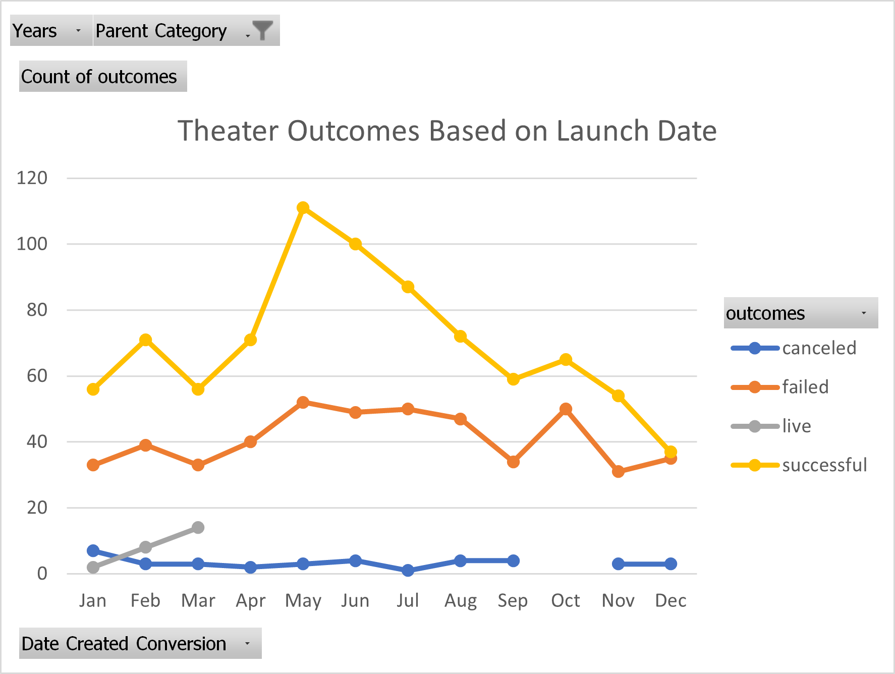
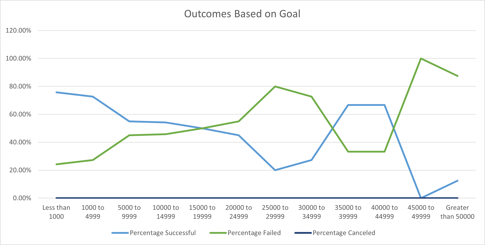

# An analysis of kickstarter campaigns
Perform an analysis on Kickstarter data to uncover trends that make crowdfunding campaigns successful.

## Overview of Project
### Purpose
Excel is a widely used data analytical tool because of its flexibility and ease of use as well as highly versatile. Benefits of excel include the ability to use advanced formulas, create interactive charts with graphs and pivot charts and organize data by using filters and conditional formatting. Formulas and filters allow us to visualize data in order to reveal trends. 

The purpose of this analysis is to examine trends within the kickstarter campaign industry, specifically for theaters and plays. An up and coming playwright wants to start a crowd funding campaign to help fund her play. She's estimating a budget of over $10,000 but wants to first see if that is an accurate estimate before jumping in to her first crowdfunding campaing. We can use excel to organize, sort, and analyze data to help her get a better sense of the accuracy of her project's estimate. We will analyze to see if there are specific factors that make a campaign successful. Using excel to analyze this data will help our client gather a better understanding of campaigns from start to finish to better plan her own campaign. 

With Excel we can: 
* Import data into a table for analysis.
* Apply filters, conditional formatting, and formulas.
* Generate and interpret pivot tables.
* Calculate summary statistics such as measures of central tendency, standard deviation, and variance.
* Characterize data to identify outliers in datasets.
* Perform an Excel analysis with visualizations.
* Interpret common Excel visualizations

## Analysis and Challenges
### Analysis of Outcomes Based on Launch Date
In examining Figure 1: Theater Outcome versus Launch, we can view categories of outcomes related to time of year the campaigns lauched. Looking at the chart below, it appears that most successful theater campaigns occured when they were kickstarted in Springtime, especially May. 

Logistically this makes sense, as it is likely that the general population tends to be very busy in the fall months leading up to holidays and likely don't put a lot of time or concern into booking and attending theater productions. Theater productions likely see heights of activity during summer and vacation months when families have more time for freedom, the weather is nicer, and they aren't looking to save their money away for the holidays and gifts, etc. 

When examining campaigns that failed, the numbers are pretty steady across the year and there doesn't seem to be a strong trend line one way or the other in favor of a certain time of year for when a campaign will decide to cancel. 

### Analysis of Outcomes Based on Goals
In examining Figure 2 Theater Outcomes versus Goals, we are examining percentage of success to failure based on various monetary goal ranges (by the thousands). In looking at the chart below, it appears that the plays that turned out to be the most successful, either had extremely feasible goals (and therefore likely appealed to the general masses who will select based on budgetary means), or they had fairly lofty goals between 35,000 to 45,000. 

Most campaigns that had goals over 45,000 did not fair so well. In comparing this trendline to percentage of campaigns failed, almost the opposite can be said, meaning that as campaigns start out with more reasonable income goals, the percentage failing is rather low and steadily increases as the campaign goals increase. There are some outliers however in the ranges 35,000 to 45,000 that cannot really be analyzed with this particular data. 

### Challenges and Difficulties Encountered
#### Deliverable 1 Challenges
This analysis was performed by creating a pivot table from the main Kickstarter Data Sheet. A pivot table is a helpful analysis for this data because it summarizes it in an easily viewable filtered way. 

The data became filtered down to focus only on theater campaigns at different times of year. Launch dates became the row while outcomes became the column and the number of outcomes was treated as a value. While I had no issues filtering this data, setting up the pivot chart, and creating a graph that easily depicts the data, I did notice that there were a few campaigns who were still acting as a live. These few live campaigns possibly could skew the data as they can't quite be considered relevant yet, as they have not yet either failed or been successful. P

#### Deliverable 2 Challenges
While I did not encounter any challenges in the first dataset, the second Figure and charting with the COUNTIF() Function, was quite a learning curve for me. It took some time and was rather tedious to first create all the monetary ranges and make sure that I entered in all the numbers correctly. Then it took me a while to figure out that I needed to place a $ sign in front of the excel range that was being classified so that the formula could be transferred on correctly. It was also extremely tedious to make sure that each column had it's category of "successful", "failed", or "canceled" correctly inputted in the formula, as well as make sure we were filtering down to "plays" for all the subcategories. Making sure all the <= or >= were inputted properly was also difficult. Once the data was all reflected and a line chart was plotted, it was much easier to see the benefit of this particular function. By summing the total projects from each category, we were then able to view the percentage of each that was successful versus failed or canceled based on the goals that were set. This is a lot of data to manipulate and analyze and a handy excel formula made it all possible. 

## Results

### Conclusions
1) Time of year matters for launching a campaign, especially in regards to theatrical plays. 
2) Campaigns that see the most success tend to start in early springtime, peaking in May and slowy wind down to seeing their lowest levels in wintertime. This makes sense as plays and theaters most often occur in summertime and so they will generate the majority of their interest in the months leading up to summer. Campaigns also saw higher levels of failure in the spring and summer months, which could be due to just the higher number of campaigns kickstarting then anyways. Campaigns also had higher failure rates in October and fall. 

### Outcomes based on Goals: 
After analyzing the dataset, we can conclude that campaigns for theatrical plays will have a corresponding correlation with the level of monetary goals set. Campaigns that had more achievable goals tended to have higher success rates while the more increasingly lofty the moentary goals became, the higher the level of failures came and the lower the number of successful campaigns. Therefore we can conclude there is generally a correspending negative relationship between financial goals set and the success of the campaign. 

### Limitations of the dataset: 
There are actually quite a few limitations to this dataset. For example, when I saw the outliers in Figure 2 where the success went up between the finanacial ranges of 30,000 to 45,000 and then back down after, I couldn't help but think that we were missing some sort of demographic and possibly geographic data to explain this occurrance. It would be interesting to filter down even further by city, by type of plays (comedies, tragedies), time of year, and then demographic data of those purchasing tickets. Limitations of the first data set might be the price of the tickets, again the geographic location like the data, the type of play, the age of the ticket purchasers, and also the type of play. 
There is also a limitation of the data analysis that we are performing. For example, even though we can see general trend lines in the line charts, we can't actually yet perform a statistical analysis to determine how strong a correlation of the dataset we might have. For example, while we can see that it seems there is a negative correlation between financial goals set and success of a campaign, we don't yet have an actual statistical measure to say how truly strong that correlation is or not. Further analysis like a regression analysis could be used if we can plot the data on a regression line. 

